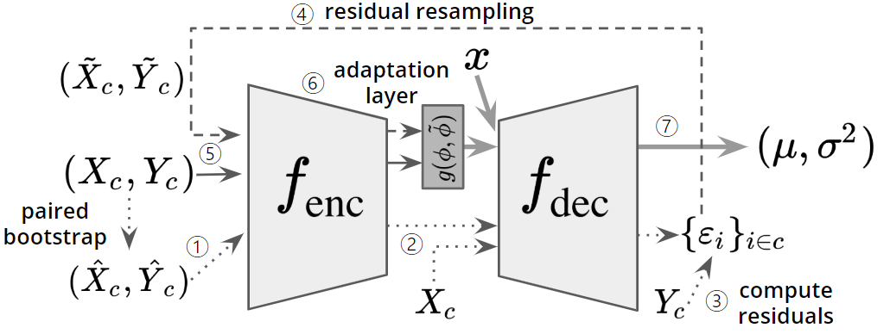

# Bootstrapping Neural Processes
The official repository for the paper [Bootstrapping Neural Processes](https://arxiv.org/abs/2008.02956) (NeurIPS 2020) by Juho Lee et al.

<p align="center">

</p>

## Abstract
Unlike in the traditional statistical modeling for which a user typically hand-specify a prior, Neural Processes (NPs) implicitly define a broad class of stochastic processes with neural networks. Given a data stream, NP learns a stochastic process that best describes the data. While this ``data-driven'' way of learning stochastic processes has proven to handle various types of data, NPs still rely on an assumption that uncertainty in stochastic processes is modeled by a single latent variable, which potentially limits the flexibility. To this end, we propose the Boostrapping Neural Process (BNP), a novel extension of the NP family using the bootstrap. The bootstrap is a classical data-driven technique for estimating uncertainty, which allows BNP to learn the stochasticity in NPs without assuming a particular form. We demonstrate the efficacy of BNP on various types of data and its robustness in the presence of model-data mismatch.

## Citation
If you find this useful in your research, please consider citing our paper:
```
@misc{lee2020bootstrapping,
    title={Bootstrapping Neural Processes},
    author={Juho Lee and Yoonho Lee and Jungtaek Kim and Eunho Yang and Sung Ju Hwang and Yee Whye Teh},
    year={2020},
    journal={arXiv preprint arXiv:2008.02956},
}
```